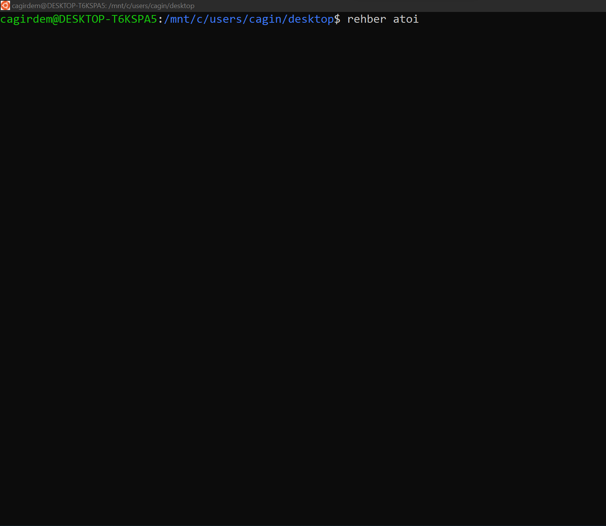
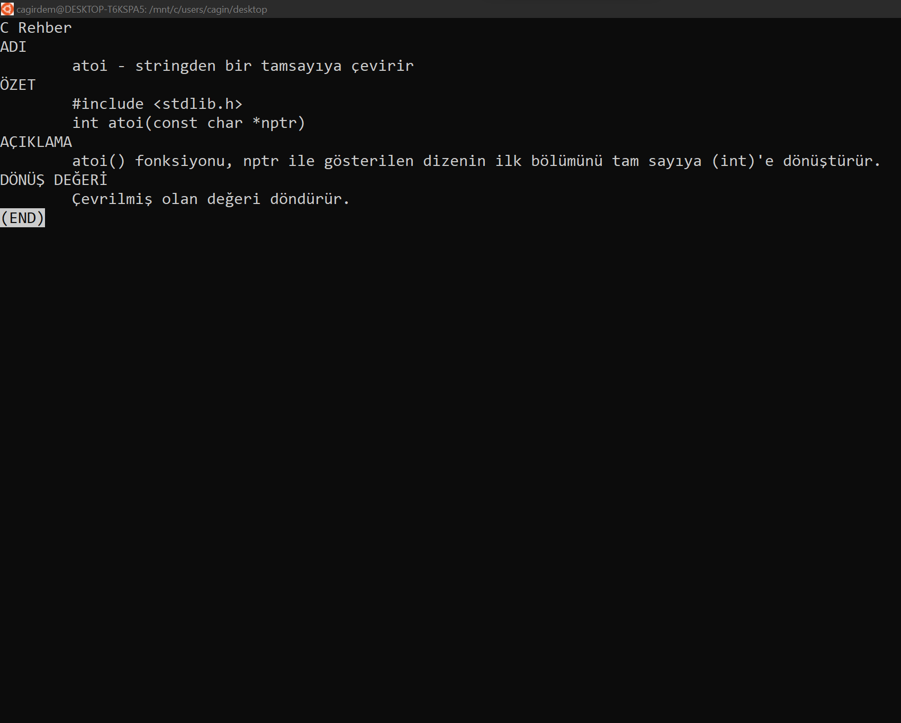

# C Rehberi

Bu proje linux manual'da bulunan fonksiyon açıklamaları Türkçe diline çevirerek bilgisayarınıza yüklemenizi sağlar. Terminal ekranınızdan rehber <fonksiyon_adi> şeklinde kullanabilirsiniz. 

Program her sorguda bu sayfada yer alan dosyaları kontrol eder ve eğer değişiklik mevcutsa günceller. Bu sayede her sorguda en güncel versiyona ait bilgilere ulaşırsınız.

